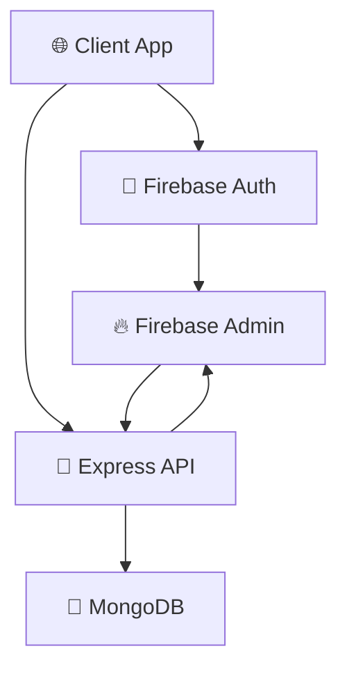

<div align="center">

# 🏠 RepairRight

**Professional Home Repair & Service Booking Platform**

*Connecting homeowners with trusted repair professionals through modern technology*

[](https://repair-right-1a8c9.web.app/)
[](https://repair-right-server.vercel.app)
[](https://react.dev/)
[](https://nodejs.org/)

[](https://firebase.google.com/)
[](https://mongodb.com/)
[](https://vitejs.dev/)
[](https://tailwindcss.com/)


</div>

---

## 📖 **About RepairRight**

RepairRight is a comprehensive, full-stack home repair and service booking platform that bridges the gap between homeowners and professional service providers. Built with modern web technologies, it offers a seamless experience for booking, managing, and tracking home repair services with real-time updates and secure authentication.

### 🎯 **Key Objectives**
- **🏠 Homeowners**: Find and book trusted repair professionals easily
- **🔧 Service Providers**: Manage services, bookings, and grow their business
- **💼 Business**: Create a reliable marketplace for home repair services
- **🚀 Technology**: Showcase modern full-stack development practices

---

## ✨ **Core Features**

### 🔐 **Authentication & Security**
- **Firebase Authentication** with email/password and Google sign-in
- **JWT-based API security** for protected routes
- **Role-based access control** for service providers and customers
- **Secure profile management** with avatar and display name updates

### 🛠️ **Service Management**
- **Add Services**: Providers can create detailed service listings with images, pricing, and coverage areas
- **Manage Services**: Full CRUD operations for service providers
- **Service Categories**: Organized service types for easy browsing
- **Advanced Search**: Facebook-style search with instant dropdown suggestions

### 📦 **Booking System**
- **One-Click Booking**: Streamlined service booking process
- **Booking Prevention**: Smart system prevents duplicate bookings and self-booking
- **Status Tracking**: Real-time booking status updates (Pending → In Progress → Completed)
- **Booking History**: Complete history for both customers and providers

### 🎨 **User Experience**
- **Responsive Design**: Mobile-first approach with perfect desktop experience
- **Dark/Light Theme**: System preference detection with manual toggle
- **Smooth Animations**: Framer Motion for professional transitions
- **Custom Notifications**: Beautiful alerts with SweetAlert2 and react-hot-toast
- **Loading States**: Custom Lottie animations for enhanced UX

### 🏆 **Advanced Features**
- **Popular Services Dashboard**: Home page highlights trending services
- **Provider Profiles**: Detailed information about service providers
- **Team Showcase**: Meet the team behind RepairRight
- **Why Choose Us**: Feature highlights and value propositions
- **Dynamic Page Titles**: SEO-friendly titles for each route
- **Error Handling**: Custom 404 and error pages with animations

---

## 🌐 **Live Demo**

Experience RepairRight in action:

**🚀 Client Application**: [https://repair-right-1a8c9.web.app/](https://repair-right-1a8c9.web.app/)

**📡 API Server**: [https://repair-right-server.vercel.app](https://repair-right-server.vercel.app)

### 🧪 **Test the Platform**
1. **Browse Services**: Explore available repair services
2. **Register/Login**: Create an account or use Google sign-in
3. **Book a Service**: Experience the seamless booking process
4. **Provider Mode**: Add your own services as a provider
5. **Manage Bookings**: Track and update service statuses

---

## 🛠️ **Technology Stack**

### 🎨 **Frontend**
| Technology | Version | Purpose |
|------------|---------|---------|
| **React** | `19.1.0` | Modern UI library with latest features |
| **Vite** | `6.3.5` | Lightning-fast build tool and dev server |
| **React Router** | `7.6.2` | Client-side routing with data loading |
| **Tailwind CSS** | `4.1.8` | Utility-first CSS framework |
| **DaisyUI** | `5.0.43` | Beautiful component library |
| **Framer Motion** | `12.16.0` | Smooth animations and transitions |

### ⚙️ **Backend**
| Technology | Version | Purpose |
|------------|---------|---------|
| **Node.js** | `Latest` | JavaScript runtime environment |
| **Express** | `5.1.0` | Web application framework |
| **MongoDB** | `6.17.0` | NoSQL database for data storage |
| **Firebase Admin** | `13.4.0` | Authentication and user management |

### 🔧 **Development Tools**
- **ESLint** - Code linting and quality
- **Axios** - HTTP client for API calls
- **CORS** - Cross-origin resource sharing
- **dotenv** - Environment variable management

---

## ⚡ **Quick Start**

### 📋 **Prerequisites**
- **Node.js** (v18 or higher)
- **npm** or **yarn**
- **MongoDB** database
- **Firebase** project setup

### 🚀 **Installation**

#### **1. Clone the Repository**
```bash
git clone https://github.com/yourusername/repair-right.git
cd repair-right
```

#### **2. Setup Client Application**
```bash
cd RepairRight-client
npm install
```

#### **3. Setup Server Application**
```bash
cd ../RepairRight-server
npm install
```

#### **4. Environment Configuration**

**Client (`.env.local`):**
```env
VITE_FIREBASE_API_KEY=your_firebase_api_key
VITE_FIREBASE_AUTH_DOMAIN=your_project.firebaseapp.com
VITE_FIREBASE_PROJECT_ID=your_project_id
VITE_FIREBASE_STORAGE_BUCKET=your_project.appspot.com
VITE_FIREBASE_MESSAGING_SENDER_ID=your_sender_id
VITE_FIREBASE_APP_ID=your_app_id
```

**Server (`.env`):**
```env
DB_USER=your_mongodb_username
DB_PASSWORD=your_mongodb_password
FB_SERVICE_KEY=your_base64_encoded_service_key
PORT=3000
```

#### **5. Run the Applications**

**Start the Server:**
```bash
cd RepairRight-server
npm start
```

**Start the Client:**
```bash
cd RepairRight-client
npm run dev
```

🎉 **Visit** [http://localhost:5173](http://localhost:5173) **to see RepairRight in action!**

---

## 📁 **Project Architecture**

### 🏗️ **Client Structure**
```
RepairRight-client/
├── 📁 src/
│   ├── 📄 App.jsx              # Main application component
│   ├── 📄 main.jsx             # Application entry point
│   ├── 📁 components/          # Reusable UI components
│   │   ├── 📁 Navbar/          # Navigation components
│   │   ├── 📁 Footer/          # Footer components
│   │   └── 📁 PopularServices/ # Service display components
│   ├── 📁 pages/               # Route-based page components
│   │   ├── 📁 AddService/      # Service creation pages
│   │   ├── 📁 ManageService/   # Service management pages
│   │   └── 📁 ServiceDetails/  # Service detail pages
│   ├── 📁 context/             # React Context providers
│   ├── 📁 hooks/               # Custom React hooks
│   ├── 📁 services/            # API service layer
│   ├── 📁 routes/              # Router configuration
│   └── 📁 ui/                  # UI utilities and components
├── 📁 public/                  # Static assets
└── 📄 package.json             # Dependencies and scripts
```

### 🌐 **Server Structure**
```
RepairRight-server/
├── 📄 index.js                 # Express server and API routes
├── 📄 package.json             # Server dependencies
├── 📄 vercel.json              # Vercel deployment config
└── 📄 .env                     # Environment variables
```

### 🔄 **Data Flow**


---

## 📡 **API Overview**

### 🔒 **Authentication Endpoints**
- Authentication handled by **Firebase Auth**
- JWT tokens verified by **Firebase Admin SDK**
- Protected routes require `Authorization: Bearer <token>` header

### 🛠️ **Service Endpoints**
| Method | Endpoint | Description | Auth Required |
|--------|----------|-------------|---------------|
| `GET` | `/services` | Get all services | ❌ |
| `GET` | `/services/:id` | Get service by ID | ❌ |
| `POST` | `/services` | Create new service | ✅ |
| `GET` | `/my-services` | Get user's services | ✅ |
| `PUT` | `/services/:id` | Update service | ✅ |
| `DELETE` | `/services/:id` | Delete service | ✅ |

### 📦 **Booking Endpoints** 
| Method | Endpoint | Description | Auth Required |
|--------|----------|-------------|---------------|
| `POST` | `/bookings` | Create booking | ✅ |
| `GET` | `/my-bookings` | Get user bookings | ✅ |
| `GET` | `/service-to-do` | Get provider bookings | ✅ |
| `PATCH` | `/bookings/:id/status` | Update booking status | ✅ |
| `GET` | `/bookings/check/:serviceId/:userEmail` | Check existing booking | ✅ |

---

## 🎯 **Key Features Deep Dive**

### 🔍 **Advanced Search System**
- **Facebook-style dropdown**: Instant search suggestions as you type
- **Multi-field search**: Search across service names, descriptions, and providers
- **Debounced input**: Optimized performance with search delay
- **Direct navigation**: Click suggestions to go directly to service details

### 🌓 **Theme System**
- **System preference detection**: Automatically detects user's OS theme preference
- **Manual toggle**: Users can override system preference
- **Persistent storage**: Theme choice saved in localStorage
- **Smooth transitions**: Animated theme switching with CSS transitions

### 📱 **Responsive Design**
- **Mobile-first approach**: Designed for mobile, enhanced for desktop
- **Breakpoint optimization**: Tailored layouts for all screen sizes
- **Touch-friendly**: Optimized touch targets and interactions
- **Progressive enhancement**: Core functionality works on all devices

### 🔐 **Security Features**
- **JWT token validation**: Secure API access with Firebase tokens
- **Route protection**: Client-side and server-side route protection
- **Input validation**: Comprehensive data validation and sanitization
- **CORS configuration**: Secure cross-origin resource sharing

---

## 🚀 **Deployment**

### 🔥 **Client Deployment (Firebase Hosting)**
```bash
cd RepairRight-client
npm run build
firebase deploy
```

### ⚡ **Server Deployment (Vercel)**
```bash
cd RepairRight-server
vercel --prod
```

### 🌍 **Environment Variables**
Ensure all environment variables are properly configured in your deployment platforms:
- **Firebase**: Set environment variables in Firebase Console
- **Vercel**: Configure environment variables in Vercel Dashboard
- **MongoDB**: Use MongoDB Atlas for production database

---

## 🛠️ **Development Scripts**

### 📱 **Client Scripts**
```bash
npm run dev      # Start development server
npm run build    # Build for production
npm run preview  # Preview production build
npm run lint     # Run ESLint
```

### 🌐 **Server Scripts**
```bash
npm start        # Start production server
npm run dev      # Start development server with nodemon
```

---

## 🤝 **Contributing**

We welcome contributions to RepairRight! Here's how you can help:

### 🔧 **Development Setup**
1. **Fork** the repository
2. **Clone** your fork: `git clone https://github.com/yourusername/repair-right.git`
3. **Create** a feature branch: `git checkout -b feature/amazing-feature`
4. **Follow** the existing code style and conventions
5. **Test** your changes thoroughly
6. **Commit** with clear messages: `git commit -m 'Add amazing feature'`
7. **Push** to your branch: `git push origin feature/amazing-feature`
8. **Open** a Pull Request

### 📝 **Contribution Guidelines**
- **Code Style**: Follow existing conventions and use ESLint
- **Testing**: Ensure all features work as expected
- **Documentation**: Update README and code comments as needed
- **Performance**: Consider performance impact of changes
- **Security**: Follow security best practices

### 🐛 **Bug Reports**
When reporting bugs, please include:
- **Environment**: OS, browser, versions
- **Steps to reproduce**: Clear step-by-step instructions
- **Expected behavior**: What should happen
- **Actual behavior**: What actually happens
- **Screenshots**: If applicable

### 💡 **Feature Requests**
For new features, please:
- **Explain the use case**: Why is this feature needed?
- **Describe the solution**: How should it work?
- **Consider alternatives**: Are there other ways to solve this?
- **Provide mockups**: Visual representations if applicable

---

## 📞 **Contact & Connect**

<div align="center">

### 👨‍💻 **Developer Information**

**Abir Shahadat Purab**  
*Full-Stack Developer & RepairRight Creator*

[](https://www.linkedin.com/in/a-s-purab)
[](mailto:a.s.purab0@gmail.com)

### 🌟 **Project Links**

[](https://repair-right-1a8c9.web.app/)
[](https://repair-right-server.vercel.app)

</div>

---

## 🙏 **Acknowledgments**

Special thanks to the amazing open-source community and these incredible technologies:

### 🚀 **Core Technologies**
- [**React**](https://react.dev/) - The library for web and native user interfaces
- [**Vite**](https://vitejs.dev/) - Next generation frontend tooling
- [**Node.js**](https://nodejs.org/) - JavaScript runtime built on Chrome's V8 engine
- [**Express**](https://expressjs.com/) - Fast, unopinionated, minimalist web framework
- [**MongoDB**](https://mongodb.com/) - The developer data platform

### 🎨 **UI & Design**
- [**Tailwind CSS**](https://tailwindcss.com/) - Utility-first CSS framework
- [**DaisyUI**](https://daisyui.com/) - The most popular component library for Tailwind CSS
- [**Framer Motion**](https://www.framer.com/motion/) - Production-ready motion library for React
- [**Lottie**](https://lottiefiles.com/) - Lightweight, scalable animations
- [**React Icons**](https://react-icons.github.io/react-icons/) - Popular icon libraries

### 🔧 **Development Tools**
- [**Firebase**](https://firebase.google.com/) - Google's mobile and web application development platform
- [**Vercel**](https://vercel.com/) - Platform for frontend frameworks and static sites
- [**SweetAlert2**](https://sweetalert2.github.io/) - Beautiful, responsive, customizable replacement for alert()
- [**React Hot Toast**](https://react-hot-toast.com/) - Smoking hot React notifications

---

<div align="center">

### 🌟 **Show Your Support**

If RepairRight helped you or you found it interesting, please consider:

⭐ **Starring** this repository  
🐛 **Reporting** issues  
💡 **Suggesting** new features  
🤝 **Contributing** to the project  
📢 **Sharing** with others  

**Built with ❤️ by [Abir Shahadat Purab](https://www.linkedin.com/in/abir-shahadat-purab-672bab343)**

*RepairRight - Where Quality Meets Convenience* 🏠✨

</div>
