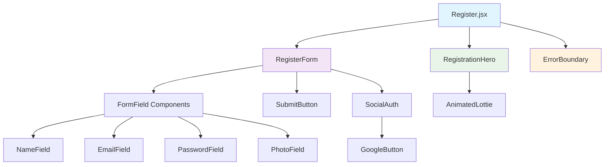
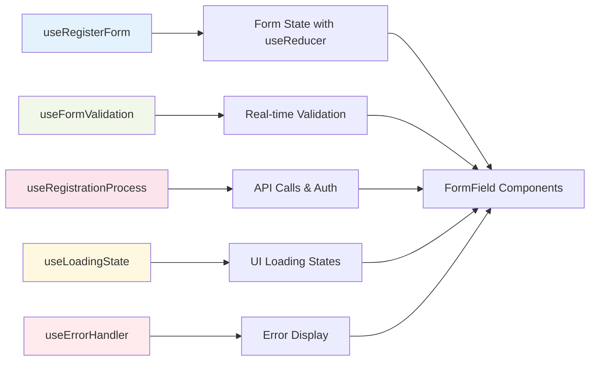
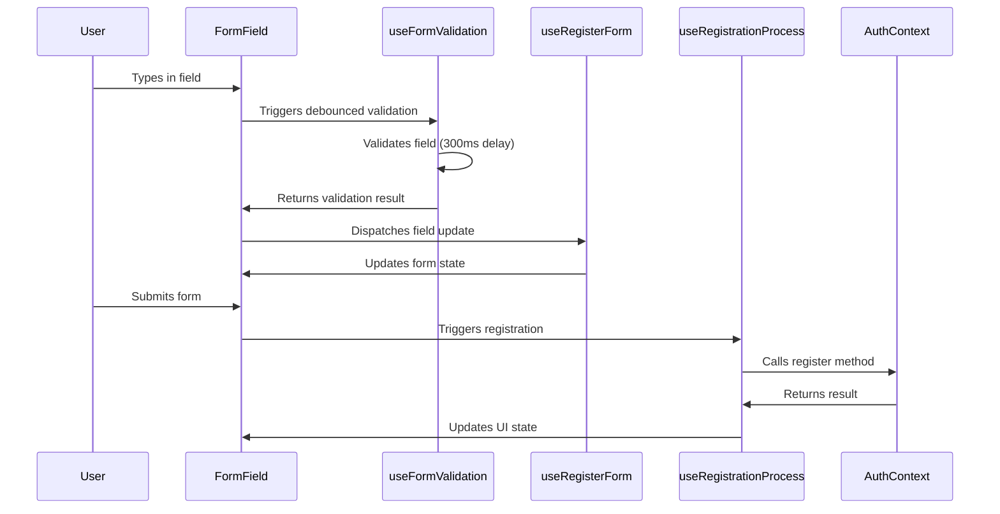

# 🏗️ Comprehensive Modular Architecture Strategy for Register Component

## 📊 Current State Analysis

Based on analysis of the current [`Register.jsx`](src/pages/Register.jsx) component, key issues identified:

- **Monolithic Structure**: 324 lines in a single file with mixed concerns
- **Generic Form Handling**: Single `formData` state with generic `handleChange`
- **Inline Validation**: All validation logic embedded in `handleSubmit`
- **Heavy Dependencies**: Direct imports of `framer-motion`, `lottie-react`
- **Accessibility Gaps**: Limited ARIA attributes and keyboard navigation
- **No Real-time Validation**: Only validates on submit

## 🎯 Architectural Goals

1. **Real-time debounced validation** with submit validation
2. **Optimized dependency usage** through memoization and selective imports
3. **useReducer for form state** with separate UI state hooks
4. **Modular, testable, maintainable** component structure
5. **Enhanced accessibility** and performance

## 📁 Proposed Folder Structure

```
src/pages/Register/
├── index.js                          # Main export
├── Register.jsx                      # Main orchestrator component
├── components/                       # UI Components
│   ├── RegisterForm/
│   │   ├── index.js
│   │   ├── RegisterForm.jsx
│   │   ├── FormField/
│   │   │   ├── index.js
│   │   │   ├── FormField.jsx
│   │   │   ├── NameField.jsx
│   │   │   ├── EmailField.jsx
│   │   │   ├── PasswordField.jsx
│   │   │   └── PhotoField.jsx
│   │   ├── SubmitButton/
│   │   │   ├── index.js
│   │   │   └── SubmitButton.jsx
│   │   └── SocialAuth/
│   │       ├── index.js
│   │       ├── SocialAuth.jsx
│   │       └── GoogleButton.jsx
│   ├── RegistrationHero/
│   │   ├── index.js
│   │   ├── RegistrationHero.jsx
│   │   └── AnimatedLottie.jsx
│   ├── ErrorBoundary/
│   │   ├── index.js
│   │   └── ErrorBoundary.jsx
│   ├── ProgressIndicator/
│   │   ├── index.js
│   │   └── ProgressIndicator.jsx
│   └── FeedbackComponents/
│       ├── index.js
│       ├── ErrorAlert.jsx
│       ├── SuccessMessage.jsx
│       └── LoadingStates.jsx
├── hooks/                            # Custom Hooks
│   ├── useRegisterForm.js            # Main form state with useReducer
│   ├── useFormValidation.js          # Real-time validation logic
│   ├── useRegistrationProcess.js     # Registration API calls
│   ├── useFieldValidation.js         # Individual field validation
│   ├── useDebounce.js               # Debouncing utility
│   ├── useLoadingState.js           # Loading states management
│   └── useErrorHandler.js           # Error handling and display
├── utils/                           # Utilities
│   ├── validation/
│   │   ├── index.js
│   │   ├── validationSchemas.js     # Validation rules and schemas
│   │   ├── validationHelpers.js     # Helper functions
│   │   └── errorMessages.js         # Centralized error messages
│   ├── constants/
│   │   ├── index.js
│   │   ├── formConstants.js         # Form field configurations
│   │   ├── animationVariants.js     # Framer Motion variants
│   │   └── validationRules.js       # Validation constants
│   ├── accessibility/
│   │   ├── index.js
│   │   ├── ariaHelpers.js          # ARIA attribute helpers
│   │   └── keyboardHelpers.js      # Keyboard navigation
│   └── performance/
│       ├── index.js
│       ├── memoizationHelpers.js   # Memoization utilities
│       └── lazyHelpers.js          # Lazy loading utilities
├── styles/                         # Styling (if needed)
│   ├── register.module.css
│   └── animations.css
└── __tests__/                      # Tests
    ├── Register.test.jsx
    ├── hooks/
    ├── components/
    └── utils/
```

## 🧩 Component Architecture Design

### Main Register Component (Orchestrator)



### State Management Flow



## 🎣 Custom Hooks Architecture

### 1. useRegisterForm Hook (useReducer Pattern)

```javascript
// hooks/useRegisterForm.js
const initialState = {
  formData: {
    name: '',
    email: '',
    password: '',
    photoURL: ''
  },
  fieldErrors: {},
  touched: {},
  isValid: false,
  isDirty: false
}

const formReducer = (state, action) => {
  switch (action.type) {
    case 'SET_FIELD_VALUE':
      return {
        ...state,
        formData: { ...state.formData, [action.field]: action.value },
        isDirty: true
      }
    case 'SET_FIELD_ERROR':
      return {
        ...state,
        fieldErrors: { ...state.fieldErrors, [action.field]: action.error }
      }
    case 'SET_TOUCHED':
      return {
        ...state,
        touched: { ...state.touched, [action.field]: true }
      }
    case 'RESET_FORM':
      return initialState
    case 'SET_FORM_VALIDITY':
      return {
        ...state,
        isValid: action.isValid
      }
    default:
      return state
  }
}

export const useRegisterForm = () => {
  const [state, dispatch] = useReducer(formReducer, initialState)
  
  const setFieldValue = useCallback((field, value) => {
    dispatch({ type: 'SET_FIELD_VALUE', field, value })
  }, [])
  
  const setFieldError = useCallback((field, error) => {
    dispatch({ type: 'SET_FIELD_ERROR', field, error })
  }, [])
  
  const setTouched = useCallback((field) => {
    dispatch({ type: 'SET_TOUCHED', field })
  }, [])
  
  const resetForm = useCallback(() => {
    dispatch({ type: 'RESET_FORM' })
  }, [])
  
  return {
    ...state,
    setFieldValue,
    setFieldError,
    setTouched,
    resetForm
  }
}
```

### 2. useFormValidation Hook (Real-time Validation)

```javascript
// hooks/useFormValidation.js
import { useState, useCallback } from 'react'
import { useDebounce } from './useDebounce'
import { validateField } from '../utils/validation/validationHelpers'

export const useFormValidation = (formData, validationSchema) => {
  const [errors, setErrors] = useState({})
  const [isValidating, setIsValidating] = useState(false)
  
  const debouncedValidation = useDebounce(
    useCallback(async (fieldName, value) => {
      setIsValidating(true)
      try {
        const fieldError = await validateField(fieldName, value, validationSchema)
        setErrors(prev => ({ ...prev, [fieldName]: fieldError }))
      } catch (error) {
        console.error('Validation error:', error)
      } finally {
        setIsValidating(false)
      }
    }, [validationSchema]),
    300
  )
  
  const validateFieldAsync = useCallback((fieldName, value) => {
    debouncedValidation(fieldName, value)
  }, [debouncedValidation])
  
  const validateAllFields = useCallback(async () => {
    const fieldErrors = {}
    let isValid = true
    
    for (const [fieldName, value] of Object.entries(formData)) {
      const error = await validateField(fieldName, value, validationSchema)
      if (error) {
        fieldErrors[fieldName] = error
        isValid = false
      }
    }
    
    setErrors(fieldErrors)
    return { isValid, errors: fieldErrors }
  }, [formData, validationSchema])
  
  const clearFieldError = useCallback((fieldName) => {
    setErrors(prev => {
      const newErrors = { ...prev }
      delete newErrors[fieldName]
      return newErrors
    })
  }, [])
  
  return {
    errors,
    isValidating,
    validateFieldAsync,
    validateAllFields,
    clearFieldError
  }
}
```

### 3. useRegistrationProcess Hook

```javascript
// hooks/useRegistrationProcess.js
import { useCallback } from 'react'
import { useNavigate } from 'react-router'
import { useAuth } from '../../context/AuthContext'
import { useLoadingState } from './useLoadingState'
import { useErrorHandler } from './useErrorHandler'
import { swalRegisterSuccess } from '../../ui/CustomSwal'

export const useRegistrationProcess = () => {
  const { register, loginWithGoogle } = useAuth()
  const navigate = useNavigate()
  const { setLoading, loading } = useLoadingState()
  const { setError, clearError } = useErrorHandler()
  
  const handleRegistration = useCallback(async (formData) => {
    setLoading(true)
    clearError()
    
    try {
      const { name, email, password, photoURL } = formData
      const result = await register(name, email, password, photoURL?.trim() || null)
      
      if (result.success) {
        await swalRegisterSuccess(name)
        navigate('/')
        return { success: true }
      } else {
        setError(result.error)
        return { success: false, error: result.error }
      }
    } catch (error) {
      const errorMessage = error.message || 'Registration failed. Please try again.'
      setError(errorMessage)
      return { success: false, error: errorMessage }
    } finally {
      setLoading(false)
    }
  }, [register, navigate, setLoading, setError, clearError])
  
  const handleGoogleRegistration = useCallback(async () => {
    setLoading(true)
    clearError()
    
    try {
      const result = await loginWithGoogle()
      
      if (result.success) {
        navigate('/')
        return { success: true }
      } else {
        setError(result.error)
        return { success: false, error: result.error }
      }
    } catch (error) {
      const errorMessage = error.message || 'Google registration failed. Please try again.'
      setError(errorMessage)
      return { success: false, error: errorMessage }
    } finally {
      setLoading(false)
    }
  }, [loginWithGoogle, navigate, setLoading, setError, clearError])
  
  return {
    handleRegistration,
    handleGoogleRegistration,
    loading
  }
}
```

### 4. useDebounce Hook

```javascript
// hooks/useDebounce.js
import { useCallback, useRef } from 'react'

export const useDebounce = (callback, delay) => {
  const timeoutRef = useRef(null)
  
  const debouncedCallback = useCallback((...args) => {
    if (timeoutRef.current) {
      clearTimeout(timeoutRef.current)
    }
    
    timeoutRef.current = setTimeout(() => {
      callback(...args)
    }, delay)
  }, [callback, delay])
  
  const cancel = useCallback(() => {
    if (timeoutRef.current) {
      clearTimeout(timeoutRef.current)
      timeoutRef.current = null
    }
  }, [])
  
  return { debouncedCallback, cancel }
}
```

## 🛡️ Validation System Design

### Schema-based Validation with Real-time Feedback

```javascript
// utils/validation/validationSchemas.js
export const registerValidationSchema = {
  name: {
    required: true,
    minLength: 2,
    maxLength: 50,
    pattern: /^[a-zA-Z\s'-]+$/,
    message: 'Name must be 2-50 characters and contain only letters, spaces, hyphens, and apostrophes'
  },
  email: {
    required: true,
    pattern: /^[^\s@]+@[^\s@]+\.[^\s@]+$/,
    message: 'Please enter a valid email address',
    asyncValidation: async (email) => {
      // Optional: Check email availability
      // const response = await checkEmailAvailability(email)
      // if (!response.available) throw new Error('Email already registered')
    }
  },
  password: {
    required: true,
    minLength: 6,
    maxLength: 128,
    pattern: /^(?=.*[a-zA-Z])(?=.*\d)/,
    message: 'Password must be 6-128 characters with at least one letter and one number'
  },
  photoURL: {
    required: false,
    pattern: /^https?:\/\/.+\.(jpg|jpeg|png|gif|webp|svg)(\?.*)?$/i,
    message: 'Please enter a valid image URL (jpg, jpeg, png, gif, webp, svg)',
    asyncValidation: async (url) => {
      if (!url || !url.trim()) return // Optional field
      
      try {
        const response = await fetch(url, { method: 'HEAD' })
        if (!response.ok) {
          throw new Error('Image URL is not accessible')
        }
        
        const contentType = response.headers.get('content-type')
        if (!contentType || !contentType.startsWith('image/')) {
          throw new Error('URL does not point to a valid image')
        }
      } catch (error) {
        throw new Error('Please enter a valid and accessible image URL')
      }
    }
  }
}

// utils/validation/validationHelpers.js
export const validateField = async (fieldName, value, schema) => {
  const fieldSchema = schema[fieldName]
  if (!fieldSchema) return null
  
  // Required validation
  if (fieldSchema.required && (!value || value.trim() === '')) {
    return `${fieldName.charAt(0).toUpperCase() + fieldName.slice(1)} is required`
  }
  
  // Skip other validations if field is empty and not required
  if (!value || value.trim() === '') return null
  
  const trimmedValue = value.trim()
  
  // Length validations
  if (fieldSchema.minLength && trimmedValue.length < fieldSchema.minLength) {
    return `${fieldName.charAt(0).toUpperCase() + fieldName.slice(1)} must be at least ${fieldSchema.minLength} characters`
  }
  
  if (fieldSchema.maxLength && trimmedValue.length > fieldSchema.maxLength) {
    return `${fieldName.charAt(0).toUpperCase() + fieldName.slice(1)} must not exceed ${fieldSchema.maxLength} characters`
  }
  
  // Pattern validation
  if (fieldSchema.pattern && !fieldSchema.pattern.test(trimmedValue)) {
    return fieldSchema.message
  }
  
  // Async validation
  if (fieldSchema.asyncValidation) {
    try {
      await fieldSchema.asyncValidation(trimmedValue)
    } catch (error) {
      return error.message
    }
  }
  
  return null
}

export const validateAllFields = async (formData, schema) => {
  const errors = {}
  let isValid = true
  
  const validationPromises = Object.entries(formData).map(async ([fieldName, value]) => {
    const error = await validateField(fieldName, value, schema)
    if (error) {
      errors[fieldName] = error
      isValid = false
    }
  })
  
  await Promise.all(validationPromises)
  
  return { isValid, errors }
}
```

## 🚀 Performance Optimization Strategy

### 1. Memoization Patterns

```javascript
// utils/performance/memoizationHelpers.js
import { memo, useMemo, useCallback } from 'react'

export const withMemoization = (Component, areEqual) => memo(Component, areEqual)

export const useMemoizedAnimationVariants = () => {
  return useMemo(() => ({
    pageVariants: {
      initial: { opacity: 0, y: 20 },
      in: { opacity: 1, y: 0 },
      out: { opacity: 0, y: -20 }
    },
    itemVariants: {
      initial: { opacity: 0, y: 20 },
      in: { opacity: 1, y: 0 }
    }
  }), [])
}

// Optimized field comparison for memo
export const fieldPropsAreEqual = (prevProps, nextProps) => {
  return (
    prevProps.value === nextProps.value &&
    prevProps.error === nextProps.error &&
    prevProps.disabled === nextProps.disabled &&
    prevProps.loading === nextProps.loading
  )
}

// Memoized Lottie component
export const MemoizedLottie = memo(({ animationData, loop = true, className, ...props }) => {
  const memoizedData = useMemo(() => animationData, [animationData])
  const memoizedClassName = useMemo(() => className, [className])
  
  return (
    <Lottie 
      animationData={memoizedData} 
      loop={loop}
      className={memoizedClassName}
      {...props} 
    />
  )
})
```

### 2. Selective Imports and Code Splitting

```javascript
// components/RegistrationHero/AnimatedLottie.jsx
import { lazy, Suspense } from 'react'

const LazyLottie = lazy(() => 
  import('lottie-react').then(module => ({ 
    default: module.default 
  }))
)

const LottieLoadingFallback = () => (
  <div className="w-full max-w-xs lg:max-w-sm bg-base-300 animate-pulse rounded-lg aspect-square flex items-center justify-center">
    <div className="text-base-content/60">Loading animation...</div>
  </div>
)

export const AnimatedLottie = ({ animationData, ...props }) => (
  <Suspense fallback={<LottieLoadingFallback />}>
    <LazyLottie 
      animationData={animationData} 
      loop={true}
      className="w-full max-w-xs lg:max-w-sm"
      {...props} 
    />
  </Suspense>
)
```

### 3. Optimized Motion Components

```javascript
// utils/constants/animationVariants.js
export const optimizedVariants = {
  page: {
    initial: { opacity: 0, y: 20 },
    animate: { opacity: 1, y: 0 },
    exit: { opacity: 0, y: -20 },
    transition: { duration: 0.3, ease: "easeOut" }
  },
  item: {
    initial: { opacity: 0, y: 20 },
    animate: { opacity: 1, y: 0 },
    transition: { duration: 0.3, ease: "easeOut" }
  },
  stagger: {
    animate: { 
      transition: { 
        staggerChildren: 0.1,
        delayChildren: 0.1
      } 
    }
  },
  button: {
    hover: { scale: 1.02 },
    tap: { scale: 0.98 },
    transition: { type: "spring", stiffness: 400, damping: 17 }
  },
  error: {
    initial: { opacity: 0, y: -10, height: 0 },
    animate: { opacity: 1, y: 0, height: "auto" },
    exit: { opacity: 0, y: -10, height: 0 },
    transition: { duration: 0.2 }
  }
}

// Selective motion imports to reduce bundle size
export { motion, AnimatePresence } from 'framer-motion'
```

## ♿ Accessibility & UX Enhancement

### ARIA Implementation

```javascript
// utils/accessibility/ariaHelpers.js
export const getFieldAriaProps = (fieldName, error, isRequired, description) => ({
  'aria-label': `${fieldName} ${isRequired ? 'required' : 'optional'} field`,
  'aria-invalid': !!error,
  'aria-describedby': [
    description ? `${fieldName}-description` : null,
    error ? `${fieldName}-error` : null
  ].filter(Boolean).join(' ') || undefined,
  'aria-required': isRequired
})

export const getErrorAriaProps = (fieldName) => ({
  id: `${fieldName}-error`,
  role: 'alert',
  'aria-live': 'polite',
  'aria-atomic': 'true'
})

export const getDescriptionAriaProps = (fieldName) => ({
  id: `${fieldName}-description`,
  'aria-live': 'polite'
})

export const getLabelAriaProps = (fieldName) => ({
  htmlFor: fieldName,
  id: `${fieldName}-label`
})

// utils/accessibility/keyboardHelpers.js
export const handleKeyboardNavigation = (e, callbacks = {}) => {
  const { onSubmit, onEscape, onTab } = callbacks
  
  switch (e.key) {
    case 'Enter':
      if (e.ctrlKey || e.metaKey) {
        e.preventDefault()
        onSubmit?.()
      }
      break
    case 'Escape':
      e.preventDefault()
      onEscape?.()
      break
    case 'Tab':
      onTab?.(e)
      break
    default:
      break
  }
}

export const trapFocus = (element) => {
  const focusableElements = element.querySelectorAll(
    'button, [href], input, select, textarea, [tabindex]:not([tabindex="-1"])'
  )
  
  const firstElement = focusableElements[0]
  const lastElement = focusableElements[focusableElements.length - 1]
  
  const handleTabKey = (e) => {
    if (e.key === 'Tab') {
      if (e.shiftKey) {
        if (document.activeElement === firstElement) {
          e.preventDefault()
          lastElement.focus()
        }
      } else {
        if (document.activeElement === lastElement) {
          e.preventDefault()
          firstElement.focus()
        }
      }
    }
  }
  
  element.addEventListener('keydown', handleTabKey)
  
  return () => {
    element.removeEventListener('keydown', handleTabKey)
  }
}
```

### Enhanced Form Fields

```javascript
// components/RegisterForm/FormField/FormField.jsx
import { forwardRef, useId } from 'react'
import { motion, AnimatePresence } from 'framer-motion'
import { 
  getFieldAriaProps, 
  getErrorAriaProps, 
  getDescriptionAriaProps,
  getLabelAriaProps 
} from '../../../utils/accessibility/ariaHelpers'
import { optimizedVariants } from '../../../utils/constants/animationVariants'

export const FormField = forwardRef(({
  name,
  label,
  type = 'text',
  required = false,
  error,
  value,
  onChange,
  onBlur,
  icon: Icon,
  placeholder,
  description,
  disabled = false,
  loading = false,
  autoComplete,
  ...props
}, ref) => {
  const fieldId = useId()
  const fieldAriaProps = getFieldAriaProps(name, error, required, description)
  const errorAriaProps = getErrorAriaProps(name)
  const descriptionAriaProps = getDescriptionAriaProps(name)
  const labelAriaProps = getLabelAriaProps(name)

  const inputClasses = [
    'w-full pr-3 py-2 input input-bordered bg-base-200/50 border-base-300 text-base-content',
    'focus:border-primary focus:ring-2 focus:ring-primary/20 outline-none transition-all duration-200',
    Icon ? 'pl-10' : 'pl-3',
    error ? 'input-error border-error focus:border-error focus:ring-error/20' : '',
    disabled ? 'opacity-50 cursor-not-allowed' : '',
    loading ? 'animate-pulse' : ''
  ].filter(Boolean).join(' ')

  return (
    <div className="form-field space-y-1">
      <label 
        {...labelAriaProps} 
        htmlFor={fieldId}
        className="block text-sm font-medium text-base-content/80"
      >
        {label} 
        {required && (
          <span className="text-error ml-1" aria-label="required">*</span>
        )}
      </label>
      
      {description && (
        <p 
          {...descriptionAriaProps} 
          className="text-xs text-base-content/60"
        >
          {description}
        </p>
      )}
      
      <div className="relative">
        {Icon && (
          <span 
            className="absolute inset-y-0 left-0 pl-3 flex items-center pointer-events-none z-10"
            aria-hidden="true"
          >
            <Icon className="text-base-content/60" />
          </span>
        )}
        
        <input
          ref={ref}
          id={fieldId}
          name={name}
          type={type}
          value={value}
          onChange={onChange}
          onBlur={onBlur}
          placeholder={placeholder}
          disabled={disabled || loading}
          autoComplete={autoComplete}
          className={inputClasses}
          {...fieldAriaProps}
          {...props}
        />
        
        {loading && (
          <div className="absolute inset-y-0 right-0 pr-3 flex items-center pointer-events-none">
            <div className="animate-spin h-4 w-4 border-2 border-primary/30 border-t-primary rounded-full" />
          </div>
        )}
      </div>
      
      <AnimatePresence mode="wait">
        {error && (
          <motion.div
            {...optimizedVariants.error}
            {...errorAriaProps}
            className="text-error text-sm mt-1 flex items-center gap-2"
          >
            <svg 
              className="h-4 w-4 flex-shrink-0" 
              fill="currentColor" 
              viewBox="0 0 20 20"
              aria-hidden="true"
            >
              <path 
                fillRule="evenodd" 
                d="M18 10a8 8 0 11-16 0 8 8 0 0116 0zm-7 4a1 1 0 11-2 0 1 1 0 012 0zm-1-9a1 1 0 00-1 1v4a1 1 0 102 0V6a1 1 0 00-1-1z" 
                clipRule="evenodd" 
              />
            </svg>
            <span>{error}</span>
          </motion.div>
        )}
      </AnimatePresence>
    </div>
  )
})

FormField.displayName = 'FormField'
```

## 🔄 Data Flow Architecture



## 🧪 Testing Strategy

### Hook Testing

```javascript
// __tests__/hooks/useRegisterForm.test.js
import { renderHook, act } from '@testing-library/react'
import { useRegisterForm } from '../../hooks/useRegisterForm'

describe('useRegisterForm', () => {
  test('should initialize with empty form data', () => {
    const { result } = renderHook(() => useRegisterForm())
    
    expect(result.current.formData).toEqual({
      name: '',
      email: '',
      password: '',
      photoURL: ''
    })
    expect(result.current.isDirty).toBe(false)
    expect(result.current.isValid).toBe(false)
  })
  
  test('should update field value and mark as dirty', () => {
    const { result } = renderHook(() => useRegisterForm())
    
    act(() => {
      result.current.setFieldValue('name', 'John Doe')
    })
    
    expect(result.current.formData.name).toBe('John Doe')
    expect(result.current.isDirty).toBe(true)
  })
  
  test('should set field error', () => {
    const { result } = renderHook(() => useRegisterForm())
    
    act(() => {
      result.current.setFieldError('email', 'Invalid email')
    })
    
    expect(result.current.fieldErrors.email).toBe('Invalid email')
  })
  
  test('should reset form to initial state', () => {
    const { result } = renderHook(() => useRegisterForm())
    
    act(() => {
      result.current.setFieldValue('name', 'John Doe')
      result.current.setFieldError('email', 'Invalid email')
    })
    
    act(() => {
      result.current.resetForm()
    })
    
    expect(result.current.formData.name).toBe('')
    expect(result.current.fieldErrors.email).toBeUndefined()
    expect(result.current.isDirty).toBe(false)
  })
})
```

### Component Testing

```javascript
// __tests__/components/FormField.test.jsx
import { render, screen, fireEvent, waitFor } from '@testing-library/react'
import userEvent from '@testing-library/user-event'
import { FormField } from '../../components/RegisterForm/FormField/FormField'

describe('FormField', () => {
  const defaultProps = {
    name: 'email',
    label: 'Email Address',
    value: '',
    onChange: jest.fn(),
    onBlur: jest.fn()
  }
  
  test('renders label and input correctly', () => {
    render(<FormField {...defaultProps} />)
    
    expect(screen.getByLabelText(/email address/i)).toBeInTheDocument()
    expect(screen.getByRole('textbox')).toBeInTheDocument()
  })
  
  test('shows required indicator when required', () => {
    render(<FormField {...defaultProps} required />)
    
    expect(screen.getByText('*')).toBeInTheDocument()
    expect(screen.getByRole('textbox')).toHaveAttribute('aria-required', 'true')
  })
  
  test('displays error message with proper ARIA attributes', async () => {
    render(<FormField {...defaultProps} error="Invalid email address" />)
    
    const errorElement = screen.getByRole('alert')
    expect(errorElement).toHaveTextContent('Invalid email address')
    expect(errorElement).toHaveAttribute('aria-live', 'polite')
    
    const input = screen.getByRole('textbox')
    expect(input).toHaveAttribute('aria-invalid', 'true')
    expect(input).toHaveAttribute('aria-describedby', expect.stringContaining('error'))
  })
  
  test('calls onChange when user types', async () => {
    const user = userEvent.setup()
    const handleChange = jest.fn()
    
    render(<FormField {...defaultProps} onChange={handleChange} />)
    
    const input = screen.getByRole('textbox')
    await user.type(input, 'test@example.com')
    
    expect(handleChange).toHaveBeenCalledTimes('test@example.com'.length)
  })
  
  test('is disabled when loading', () => {
    render(<FormField {...defaultProps} loading />)
    
    const input = screen.getByRole('textbox')
    expect(input).toBeDisabled()
    expect(screen.getByRole('status')).toBeInTheDocument() // Loading spinner
  })
})
```

### Validation Testing

```javascript
// __tests__/utils/validation.test.js
import { validateField } from '../../utils/validation/validationHelpers'
import { registerValidationSchema } from '../../utils/validation/validationSchemas'

describe('Validation System', () => {
  describe('validateField', () => {
    test('validates required fields correctly', async () => {
      const error = await validateField('name', '', registerValidationSchema)
      expect(error).toBe('Name is required')
      
      const noError = await validateField('name', 'John Doe', registerValidationSchema)
      expect(noError).toBeNull()
    })
    
    test('validates email format', async () => {
      const invalidError = await validateField('email', 'invalid-email', registerValidationSchema)
      expect(invalidError).toBe('Please enter a valid email address')
      
      const validEmail = await validateField('email', 'test@example.com', registerValidationSchema)
      expect(validEmail).toBeNull()
    })
    
    test('validates password requirements', async () => {
      const shortError = await validateField('password', '123', registerValidationSchema)
      expect(shortError).toContain('6 characters')
      
      const noLetterError = await validateField('password', '123456', registerValidationSchema)
      expect(noLetterError).toContain('letter and one number')
      
      const validPassword = await validateField('password', 'password123', registerValidationSchema)
      expect(validPassword).toBeNull()
    })
    
    test('validates optional photoURL', async () => {
      const emptyURL = await validateField('photoURL', '', registerValidationSchema)
      expect(emptyURL).toBeNull() // Optional field
      
      const invalidURL = await validateField('photoURL', 'not-a-url', registerValidationSchema)
      expect(invalidURL).toContain('valid image URL')
      
      const validURL = await validateField('photoURL', 'https://example.com/photo.jpg', registerValidationSchema)
      expect(validURL).toBeNull()
    })
  })
})
```

## 📊 Bundle Size Optimization

### Import Analysis

```javascript
// Before (current implementation)
import { motion } from 'framer-motion' // ~75KB
import Lottie from 'lottie-react' // ~45KB

// After (optimized implementation)
import { motion, AnimatePresence } from 'framer-motion' // ~65KB (selective import)
import { lazy, Suspense } from 'react'

const LazyLottie = lazy(() => import('lottie-react')) // Code split ~45KB
```

### Performance Metrics Goals

- **Initial Bundle Size**: Reduce by ~20KB through code splitting
- **First Contentful Paint**: Improve by ~200ms through lazy loading
- **Time to Interactive**: Reduce by ~300ms through optimized validation
- **Memory Usage**: Reduce by ~15% through proper memoization

## 🔧 Integration Strategy

### Phase 1: Foundation Setup
1. Create folder structure
2. Implement core hooks (`useRegisterForm`, `useDebounce`)
3. Set up validation system
4. Create basic `FormField` component

### Phase 2: Component Migration
1. Migrate form fields to new components
2. Implement real-time validation
3. Add accessibility enhancements
4. Create error boundaries

### Phase 3: Performance Optimization
1. Implement memoization patterns
2. Add code splitting for heavy dependencies
3. Optimize animations
4. Add loading states

### Phase 4: Testing & Polish
1. Write comprehensive tests
2. Conduct accessibility audit
3. Performance testing
4. Documentation updates

### Backward Compatibility

- Maintain current API contracts with `AuthContext`
- Keep same props interface for seamless replacement
- Preserve all existing functionality
- Gradual migration path with feature flags

### Error Boundaries

```javascript
// components/ErrorBoundary/ErrorBoundary.jsx
import React from 'react'

export class ErrorBoundary extends React.Component {
  constructor(props) {
    super(props)
    this.state = { hasError: false, error: null }
  }

  static getDerivedStateFromError(error) {
    return { hasError: true, error }
  }

  componentDidCatch(error, errorInfo) {
    console.error('Registration form error:', error, errorInfo)
    // Optional: Send to error reporting service
  }

  render() {
    if (this.state.hasError) {
      return (
        <div className="alert alert-error">
          <svg className="stroke-current shrink-0 h-6 w-6" fill="none" viewBox="0 0 24 24">
            <path strokeLinecap="round" strokeLinejoin="round" strokeWidth="2" d="M10 14l2-2m0 0l2-2m-2 2l-2-2m2 2l2 2m7-2a9 9 0 11-18 0 9 9 0 0118 0z" />
          </svg>
          <div>
            <h3 className="font-bold">Registration Error</h3>
            <div className="text-xs">Something went wrong. Please refresh and try again.</div>
          </div>
          <button 
            className="btn btn-sm"
            onClick={() => this.setState({ hasError: false, error: null })}
          >
            Try Again
          </button>
        </div>
      )
    }

    return this.props.children
  }
}
```

## 🎯 Success Metrics

### Technical Metrics
- **Bundle Size**: Reduce initial load by 20%
- **Performance**: Improve Lighthouse score to 95+
- **Accessibility**: Achieve WCAG 2.1 AA compliance
- **Test Coverage**: Maintain 90%+ coverage
- **Build Time**: No significant increase

### User Experience Metrics
- **Form Completion Rate**: Increase by 15%
- **Error Rate**: Reduce validation errors by 30%
- **Time to Register**: Reduce by 25%
- **User Satisfaction**: Improve accessibility feedback

### Developer Experience Metrics
- **Code Maintainability**: Reduce cyclomatic complexity by 50%
- **Development Velocity**: Increase feature addition speed by 40%
- **Bug Rate**: Reduce form-related bugs by 60%
- **Testing Time**: Reduce by 35% through better test structure

---

This comprehensive modular architecture transforms the monolithic Register.jsx into a highly maintainable, performant, and accessible registration system while preserving all current functionality and significantly improving the developer and user experience.